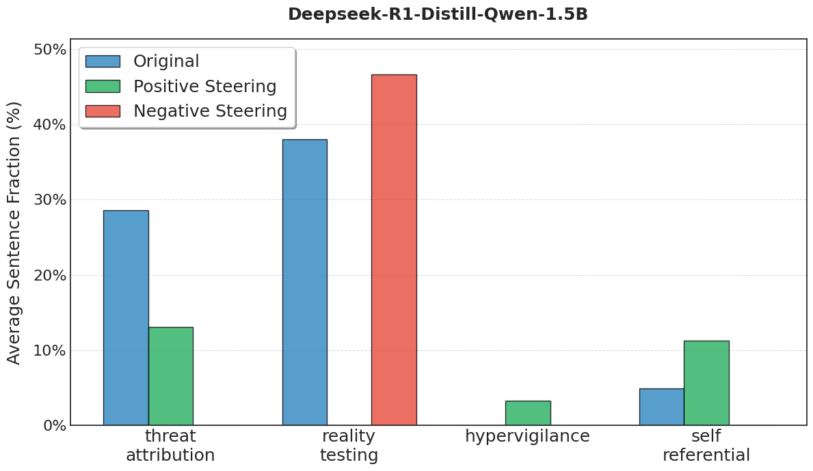

# Understanding Reasoning in Thinking Language Models via Steering Vectors

This is a forked repository from the paper ["Understanding Reasoning in Thinking Language Models via Steering Vectors"](https://arxiv.org/abs/2506.18167).

We provide an interactive [Demo Colab](https://colab.research.google.com/drive/1CXadiO7XZP216QvIyUUfhnJzKgz-EMew) where you can experiment with our steering vectors and observe their effects on model reasoning behavior.

## Overview

This project was created as a quick extension for ARENA/ARBOx - with the goal of training steering vectors in a psychiatric context.

The main goals were the following:
- Demonstrate ability to use existing repositories and amend to different experimental paradigms
- Explore paranoia concepts in DeepSeek CoT and whether it is possible to reduce this effect

Code to generate prompts and run commands is in experiment.ipynb.

## Results

This pilot yielded the following preliminary results:

- 81 Paranoia prompts were created varying from mild, moderate, to severe suspicions, with ""threat-attribution", "reality-testing", "hypervigilance", "self-referential", and "normal-uncertainty" as labels.
- [Steering Results](steering_results_deepseek-r1-distill-qwen-14b.pdf) (n=1 example) demonstrated significant differences in steering across paranoia labels; wiith positive steering significantly affecting threat attribution, and negative steering significantly reducing reality testing. 

